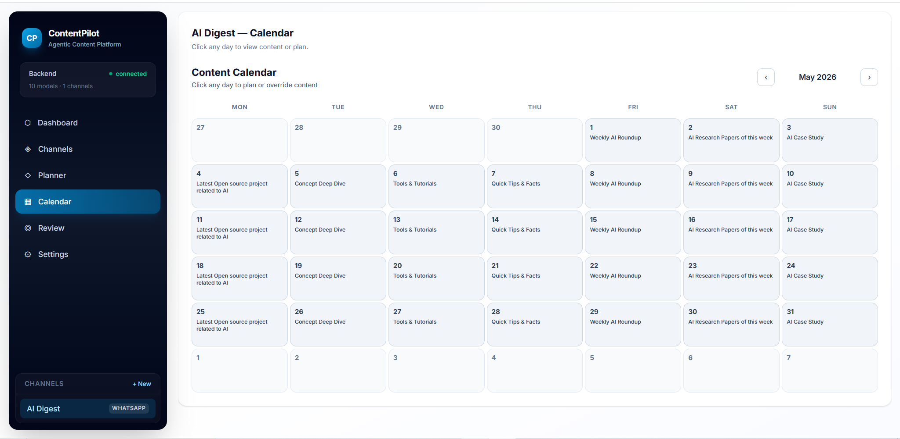
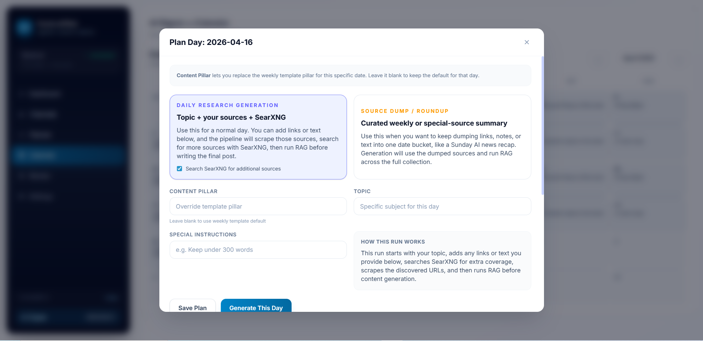
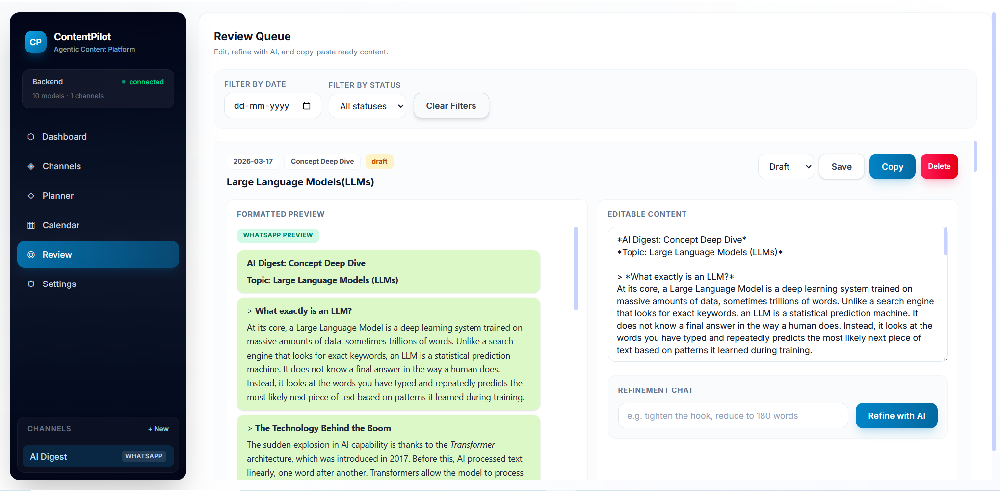

# ContentPilot

ContentPilot is a local-first, agentic content generation platform for planning, generating, formatting, and reviewing social content across multiple channels.




## Overview

- Multi-agent pipeline using LangGraph (Research, Summarize, Writer, Formatter, Quality).
- Advanced RAG: Parent-child chunking, trafilatura web scraping, cross-encoder re-ranking, and query expansion.
- Weekly planning with calendar-level date overrides.
- Two generation modes:
  - Pre-generated research mode (web research through SearXNG).
  - Source dump mode (async parallel map-reduce summarization).
- Channel memory layers for contextual notes, episodic topic avoidance, and refinement-driven preferences.
- Optional Gemini image generation for finished posts.
- Platform-aware output formatting (LinkedIn, Twitter/X, WhatsApp, Telegram).
- Real-time generation progress via SSE streams.
- Review queue with edit and refinement workflow.

## Current Tech Stack

- Backend: FastAPI, LangGraph, SQLAlchemy, Pydantic, PostgreSQL, httpx, trafilatura.
- Frontend: React + Vite.
- AI runtime: Ollama (local model serving).
- Search: SearXNG (Docker).
- Optional image generation: Gemini.

## Repository Layout

- `backend/`: FastAPI app, LangGraph agents, services, data models.
- `frontend/`: React app and UI components.
- `docker-compose.yml`: Local multi-service setup.

## Quick Start

### 1. Prerequisites

- Python 3.10+
- Node.js 18+
- Ollama running locally
- Docker Desktop (Required for Postgres and SearXNG)

### 2. Start Infrastructure (Database & Search)

```bash
docker compose up -d postgres searxng
```

### 3. Start Backend

```bash
cd backend
uv sync
uvicorn main:app --reload --port 8000
```

### 3. Start Frontend

```bash
cd frontend
npm install
npm run dev
```

### 5. Optional: Gemini Image Generation

```bash
# Save a Gemini API key in Settings to enable image generation in the review queue.
```

Open the frontend on the URL printed by Vite (typically `http://localhost:5173`).

## How the Flow Works

1. Configure runtime settings from the app.
2. Create or select a channel profile.
3. Plan content in weekly templates and date-level overrides.
4. Generate content for a day or week.
5. Review, refine, and export platform-ready output.
